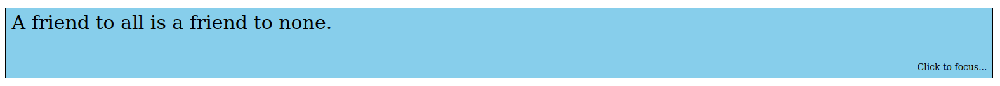
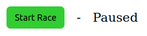
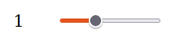
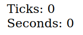
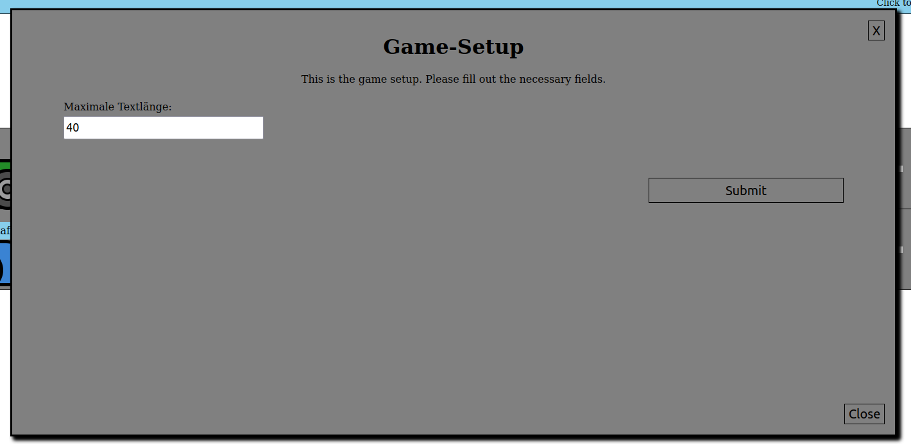
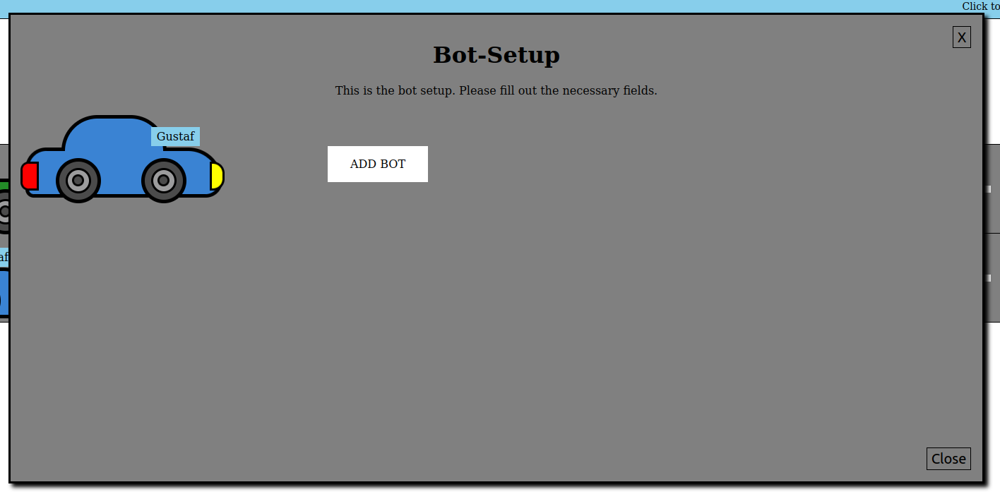
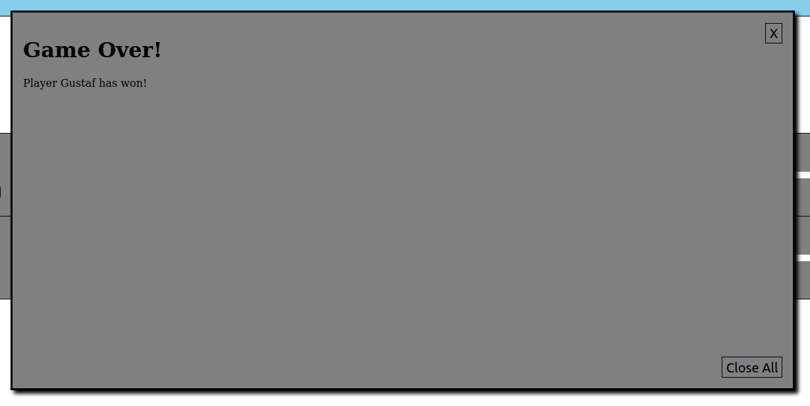
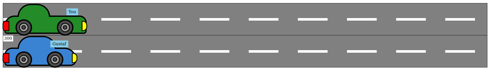

# Simulationsprojekt

## Installation

Repository klonen und in den `browser/` Ordner navigieren. Nach anschließendem Ausführen einer der folgenden Kommandos, sollte das Programm unter [localhost:4200](localhost:4200) erreichbar sein.

```bash
git clone https://github.com/jannickbath/simulationsprojekt-angular.git
cd simulationsprojekt-angular/dist/simulationsprojekt/browser
```

### PHP

Vorraussetzungen:
- PHP


```bash
php -S localhost:4200
```

### Python

Vorraussetzungen:
- Python

```bash
python3 -m http.server 4200
# oder
py -m http.server 4200
```

## Beschreibung UI

### Textbox



Die Textbox ist ein Hauptbestandteil des Spiels, es ermöglicht dem Spieler direkt mit dem Spiel zu interagieren.

Die Textbox kann verwendet werden, sobald das Spiel gestartet wurde.

Richtig getippte Buchstaben werden grün markiert. Falsch getippte Buchstaben werden rot markiert.

Bei richtig getippten Buchstaben bewegt sich das Auto des Spielers voran.

Der Spieler hat die Möglichkeit zu gewinnen, sobald er alle Zeichen richtig getippt hat. Dabei muss er allerdings schneller als die Bots sein.

### Start/Stop Button



Hiermit lässt sich das Spiel starten und beenden.

Der Indikator rechts zeigt an, in welchem Zustand sich das Spiel gerade befindet ("Paused" oder "Running").

Wenn das Spiel während der Laufzeit beendet wird, dann wird der Fortschritt aller Spieler zurückgesetzt und ein neuer Text von der API bezogen.

### Open Setup


Mit diesem Button lässt sich das Menü für die Spiel-Einstellungen öffnen.

### Open Bots


Mit diesem Button lässt sich das Menü für die Bot-Konfiguration öffnen.

### Game Delay Slider



Mit diesem Slider lässt sich die Simulationsgeschwindigkeit einstellen.

Durch den Slider wird nicht die Simulationsgeschwindigkeit direkt geändert, sondern die Verzögerung zwischen den Spiel-Ticks.

Desto höher der Wert, desto langsamer wird die Simulation, da die Verzögerung erhöht wird.

Es gibt 4 Einstellungsmöglichkeiten:
 - 0.5 -> Verzögerung = 500ms
 - 1 -> Verzögerung = 1000ms
 - 1.5 -> Verzögerung = 1500ms
 - 2 -> Verzögerung = 2000ms

### Clock



Zeigt die bereits vergangen Ticks und absolute Ausführungszeit an.

### Game Setup



Dies ist das Spiel-Einstellungs Popup.

Hier kann die maximale Anzahl an Zeichen für den Text in der Textbox angegeben werden.

Das Text Limit kann durch Aktivierung von Items überschritten werden, denn es bezieht sich nur auf den initialen Text.

### Bot Setup



Dies ist das Popup zur Verwaltung der Bots.

Bots können entfernt werden, indem man mit der Maus auf sie drauf klickt.

Ein neuer Bot kann durch einen Klick auf den Button "ADD BOT" hinzugefügt werden.
Anschließend wird nach einem Namen und einer Geschwindigkeit (in cpm) gefragt.

- ADD BOT
  - Name: Name des Bots, wird automatisch mit Bot [index] befüllt
  - Speed: Geschwindigkeit des Bots, wird automatisch mit 300(cpm) befüllt

### Game Over



Dieses Popup taucht auf, sobald ein Bot oder der Spieler einen Fortschritt von 100% erreicht hat.

Der Spieler kann dies tun, indem er alle Zeichen in der Textbox richtig getippt hat.

Die Bots erreichen diesen Wert nach einer bestimmten Zeit.

### Tracks



Diese Komponente veranschaulicht den Fortschritt des Spielers und aller Bots.

Das Auto des Spielers ist immer grün und hat ein leicht anderes Model.

Jedes Auto trägt zusätzlich den Namen des dazugehörigen Spielers, um die Autos besser voneinander unterscheiden zu können.

Die kleine weiße Box zeigt die Base-Geschwindigkeit (in cpm) des jeweiligen Bots an.

## Zufallsparameter

- Welcher Text von der API bezogen wird
  - Der Text wird zufällig vom [Quotable API-Endpunkt](https://api.quotable.io/quotes/random) bezogen
- Um wieviel cpm jeder Bot, jeden Tick von seinem baseSpeed abweicht
  - Zufällige Abweichung zwischen -50cpm und 50cpm
- Wann ein Barriere-Item auftaucht und wie hoch der Schaden ist
    - Desto weiter der Spieler oder die Bots vorangekommen sind, desto höher ist die Warscheinlichkeit, dass eine Barriere auftaucht.
    - Die CPM-Penalty für Bots wird zufällig zwischen -35 und -75 ausgewählt
    - Bei einem Spieler wird bei Kollision mit einer Barriere weiterer Text von der API geholt

    - Beispiele Warscheinlichkeit für eine Barriere bei Bots:
     - Progress: 25% -> 25 / 3 -> 8.3%
     - Progress: 50% -> 50 / 3 -> 16.67%
     - Progress: 80% -> 80 / 3 -> 26.67%

    - Beispiele Warscheinlichkeit für eine Barriere bei Spielern:
     - Progress: 25% -> 25 / 4 -> 6.25%
     - Progress: 50% -> 50 / 4 -> 12.5%
     - Progress: 80% -> 80 / 4 -> 20%

## Eingabeparameter

- Bots hinzufügen (Name, Geschwindigkeit)
- Maximale Textlänge bestimmen
- Simulationsgeschwindigkeit anpassen
- Eingabe von Text in der Textbox

---

This project was generated with [Angular CLI](https://github.com/angular/angular-cli) version 17.1.0.